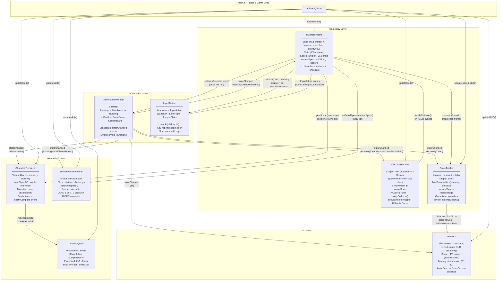

# Robo Rhapsody — Neon Fugitive: System Architecture

> **Last Updated**: 2026-03-31
> **Sprint**: 1 (Post-S1-12)
> **Stack**: Three.js r168 + Rapier (via enable3d) · TypeScript · Vite

---

## Layer Overview

The codebase is divided into four layers. Data flows strictly downward; no lower layer imports from a higher one.

```
┌─────────────────────────────────────┐
│           UI Layer                  │  GameUI
├─────────────────────────────────────┤
│         Gameplay Layer              │  RunnerSystem · ObstacleSystem · ScoreTracker
├─────────────────────────────────────┤
│         Rendering Layer             │  CharacterRenderer · EnvironmentRenderer · CameraSystem
├─────────────────────────────────────┤
│         Foundation Layer            │  GameStateManager · InputSystem
└─────────────────────────────────────┘
                    ↕
              main.ts (boot + game loop)
```

---

## Full System Diagram



---

## Key Architectural Decisions

| Decision | Rationale |
|----------|-----------|
| **Dependency Injection** | Every system accepts GSM, InputSystem, scene etc. as constructor params — no singleton imports in tests. Enables clean isolated unit testing. |
| **GSM as event bus** | Systems subscribe to `stateChanged` rather than polling. Decouples enable/disable logic from the game loop. |
| **RunnerSystem owns InputSystem** | Runner is the sole caller of `enable()`/`disable()`. No other system touches input gating. |
| **RunnerSystem is sole `setScrollSpeed()` caller** | EnvironmentRenderer GDD contract — prevents drift if Difficulty Curve and Runner both write speed. |
| **Object pools (obstacles, environment chunks)** | Zero allocations in the hot path. Pools pre-allocated at startup, never grown at runtime. |
| **AABB collision (placeholder)** | Rapier physics bodies are wired to the world but not yet to scene objects. AABB in ObstacleSystem is an intentional temporary stub; replace with Rapier `onCollisionEnter` + `OBSTACLE_GROUP` filter in the physics integration sprint. |
| **Simulated gravity in RunnerSystem** | Same placeholder reason — `_yVelocity` accumulator stands in until Rapier bodies are attached to the robot. |

---

## Config Objects

Every system's tuning values live in a dedicated config object in `src/config/`:

| Config | System | Key Values |
|--------|--------|------------|
| `CAMERA_SYSTEM_CONFIG` | CameraSystem | fov=75, xLerpFactor=8, zOffset=8, yOffset=3 |
| `CHARACTER_RENDERER_CONFIG` | CharacterRenderer | deathDuration=2000, placeholderColor |
| `ENVIRONMENT_RENDERER_CONFIG` | EnvironmentRenderer | chunkCount=5, chunkLength=20, recycleBuffer=28 |
| `RUNNER_SYSTEM_CONFIG` | RunnerSystem | jumpForce=12, gravity=30, slideDuration=600, maxSpeed=25 |
| `OBSTACLE_SYSTEM_CONFIG` | ObstacleSystem | spawnInterval=2.0, spawnDistance=30, minObstacleGap=8 |
| `OBSTACLE_TYPE_REGISTRY` | ObstacleSystem | Barrier (centerY=0.5), Drone (centerY=1.25) |
| `SCORE_TRACKER_CONFIG` | ScoreTracker | deltaClamp=0.05 |

---

## File Map

```
src/
├── main.ts                          Boot, game loop, system wiring
├── config/
│   ├── camera-system.config.ts
│   ├── character-renderer.config.ts
│   ├── environment-renderer.config.ts
│   ├── obstacle-system.config.ts    Includes OBSTACLE_TYPE_REGISTRY
│   ├── runner-system.config.ts
│   └── score-tracker.config.ts
└── core/
    ├── game-state-manager.ts        Foundation
    ├── input-system.ts              Foundation
    ├── character-renderer.ts        Rendering
    ├── environment-renderer.ts      Rendering — exports LANE_* constants
    ├── camera-system.ts             Rendering
    ├── runner-system.ts             Gameplay
    ├── obstacle-system.ts           Gameplay
    ├── score-tracker.ts             Gameplay
    └── game-ui.ts                   UI
```
